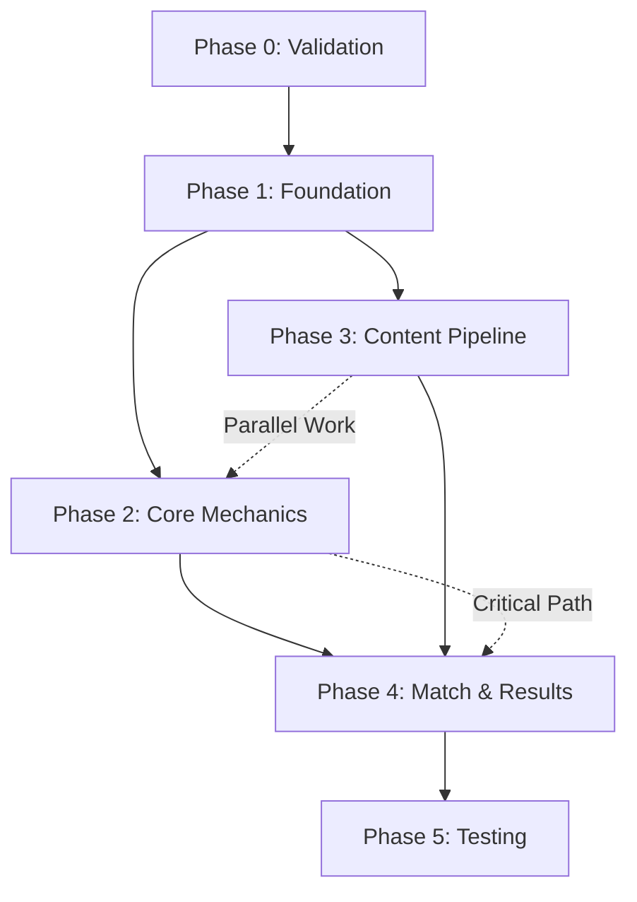

# DinnerMatch Implementation Workflow
**Generated**: 2025-11-16
**Strategy**: Systematic
**Depth**: Deep Analysis
**Timeline**: 8-10 weeks (ideal team) / 12 weeks (minimum team)

## Executive Summary

DinnerMatch is a real-time, synchronous mobile application for couples to reach dining consensus through gamified swiping. The implementation requires careful orchestration of WebSocket infrastructure, mobile development, and third-party integrations.

**Critical Success Factor**: Real-time synchronization reliability across mobile networks

## Risk Assessment

### 🔴 Critical Risks
- **WebSocket Sync Complexity**: Real-time sync is mission-critical
- **Content Variety**: Only 10 restaurants will cause repetition fatigue
- **User Acquisition**: No clear strategy for initial 10K users

### 🟡 High Risks
- **Dietary Filter Accuracy**: Dependent on incomplete API data
- **Session State Management**: Complex edge cases poorly defined
- **Performance Requirements**: <100ms swipe latency challenging

### 🟢 Medium Risks
- **Third-party API Limits**: Restaurant API rate limiting
- **Cross-platform Consistency**: iOS/Android behavior differences
- **Network Interruptions**: Graceful recovery mechanisms

## Phase 0: Technical Validation Spike (Week 1-2)

**Goal**: Validate core technical feasibility before full commitment

### Critical Experiments
```
1. WebSocket Proof-of-Concept
   - 2 devices syncing swipe gestures
   - Measure latency and reliability
   - Test across different networks (WiFi, 4G, 5G)

2. React Native Performance Test
   - Swipe gesture responsiveness
   - Animation performance on low-end devices
   - Memory usage during sessions

3. API Integration Validation
   - Yelp/Google Places rate limits
   - Data quality for dietary filters
   - Content variety assessment

4. Matching Algorithm Prototype
   - Basic consensus detection
   - Multi-round logic
   - Edge case handling
```

### Go/No-Go Decision Gates
- ✅ WebSocket sync <500ms latency → Proceed
- ⚠️ 500-1000ms latency → Implement with fallback
- ❌ >1000ms latency → Pivot to async voting

## Phase 1: Foundation (Weeks 1-2)

### Track A: Backend Infrastructure
```yaml
Developer: Backend Lead
Tasks:
  - PostgreSQL schema design
  - Node.js/Express API setup
  - JWT authentication implementation
  - Google/Facebook OAuth integration
  - User/Group management endpoints

Deliverables:
  - Auth endpoints working
  - Database migrations complete
  - API documentation
```

### Track B: Mobile Foundation
```yaml
Developer: Frontend Lead
Tasks:
  - React Native + Expo setup
  - Navigation structure
  - Theme system implementation
  - Basic UI components
  - Authentication screens

Deliverables:
  - Login/signup flow
  - Navigation working
  - Component library started
```

### Track C: DevOps Setup
```yaml
Developer: DevOps Engineer
Tasks:
  - Docker environment setup
  - CI/CD pipeline configuration
  - Staging environment deployment
  - Monitoring integration (Sentry)

Deliverables:
  - Local dev environment
  - Automated testing pipeline
  - Staging deployment ready
```

## Phase 2: Core Mechanics (Weeks 3-4)

### Track A: Real-time Engine
```yaml
Developer: Backend Lead
Tasks:
  - Socket.io server implementation
  - Session state management (Redis)
  - WebSocket protocol design
  - Reconnection logic
  - Conflict resolution

Dependencies: Phase 1 completion
Deliverables:
  - WebSocket server live
  - Session create/join working
  - State synchronization tested
```

### Track B: Swipe Interface
```yaml
Developer: Frontend Lead
Tasks:
  - Swipe gesture implementation
  - Card stack UI component
  - Timer countdown display
  - Multi-round progression
  - Match animation

Dependencies: Phase 1 completion
Deliverables:
  - Swipe mechanics working
  - Timer synchronized
  - Round progression logic
```

### Track C: State Management
```yaml
Developer: Full-Stack Dev
Tasks:
  - Redux/Zustand setup
  - WebSocket integration
  - Optimistic updates
  - Offline queue handling
  - Session recovery

Dependencies: Track A WebSocket
Deliverables:
  - Global state working
  - Real-time sync tested
  - Offline handling complete
```

## Phase 3: Content Pipeline (Weeks 5-6)

### Track A: Restaurant Integration
```yaml
Developer: Backend Dev
Tasks:
  - Yelp API integration
  - Google Places fallback
  - Data normalization
  - Caching strategy (Redis)
  - Sponsored content structure

Parallel: Can start immediately
Deliverables:
  - 50+ restaurants loaded
  - API abstraction layer
  - Cache warming implemented
```

### Track B: Recipe System
```yaml
Developer: Full-Stack Dev
Tasks:
  - Recipe API integration
  - Web scraping pipeline
  - Data normalization
  - Image optimization
  - Nutrition data parsing

Parallel: Can start immediately
Deliverables:
  - 100+ recipes loaded
  - Normalized schema
  - Image CDN setup
```

### Track C: Filtering Engine
```yaml
Developer: Backend Dev
Tasks:
  - Dietary restriction matching
  - Energy level algorithm
  - Content rotation logic
  - "Recently seen" tracking
  - Preference learning system

Dependencies: Tracks A & B
Deliverables:
  - Filter accuracy >95%
  - Smart rotation working
  - Preference tracking active
```

## Phase 4: Match & Results (Week 7)

### Track A: Match Flow
```yaml
Developer: Full-Stack Team
Tasks:
  - Match detection logic
  - Result screens UI
  - Restaurant details view
  - Recipe full view
  - Shopping list feature

Dependencies: All previous phases
Deliverables:
  - Match flow complete
  - All post-match actions
  - Shopping list working
```

### Track B: External Integrations
```yaml
Developer: Backend Dev
Tasks:
  - Maps integration (iOS/Android)
  - Reservation system hooks
  - Calendar integration prep
  - Push notifications setup
  - Analytics events

Dependencies: Phase 4A
Deliverables:
  - Maps launching correctly
  - Notifications working
  - Analytics tracking
```

## Phase 5: Testing & Polish (Week 8)

### Parallel Testing Tracks
```yaml
E2E Testing:
  - Complete session flows
  - Multi-device synchronization
  - Network interruption recovery
  - Cross-platform validation

Performance Testing:
  - Load testing (100 concurrent sessions)
  - Latency benchmarks
  - Memory profiling
  - Battery usage optimization

User Testing:
  - 20 couple beta test
  - Feedback collection
  - Critical bug fixes
  - UX improvements
```

## Dependency Map



## Team Allocation

### Ideal Team (5 developers)
```
1. Technical Lead - Architecture & WebSockets
2. Backend Developer - APIs & Database
3. Frontend Developer - React Native
4. Full-Stack Developer - Content & Integrations
5. DevOps/QA Engineer - Infrastructure & Testing
```

### Minimum Team (3 developers)
```
1. Full-Stack Lead - Backend focus + Architecture
2. Frontend Developer - React Native specialist
3. Full-Stack Developer - Content & DevOps
```

## Critical Path Items

### Week 1-2 Checkpoints
- [ ] WebSocket POC validated
- [ ] Authentication working
- [ ] Basic UI framework ready

### Week 3-4 Checkpoints
- [ ] Real-time sync functional
- [ ] Swipe mechanics smooth
- [ ] State management solid

### Week 5-6 Checkpoints
- [ ] 50+ restaurants loaded
- [ ] Dietary filters accurate
- [ ] Content variety sufficient

### Week 7-8 Checkpoints
- [ ] Complete flow tested
- [ ] Performance targets met
- [ ] Beta users onboarded

## Technology Stack Decisions

### Confirmed Stack
```yaml
Frontend:
  - React Native 0.81.5
  - Expo SDK ~54.0
  - TypeScript (strict mode)
  - Socket.io-client
  - React Query
  - Zustand (state management)

Backend:
  - Node.js + Express
  - PostgreSQL (primary DB)
  - Redis (cache + sessions)
  - Socket.io (WebSockets)
  - JWT authentication

Infrastructure:
  - AWS/Heroku deployment
  - GitHub Actions CI/CD
  - Sentry error tracking
  - Mixpanel analytics
```

## Success Metrics

### MVP Launch Criteria
- ✅ 50 beta couples active
- ✅ 70% match rate < 5 minutes
- ✅ <200ms swipe latency
- ✅ <500ms sync latency
- ✅ Zero critical bugs
- ✅ 4.0+ beta feedback score

### Post-Launch Targets (Month 1)
- 500 active couples
- 60% weekly retention
- 30% premium conversion
- 25 restaurant partners
- <1% crash rate

## Risk Mitigation Strategies

### WebSocket Failure
**Primary**: Socket.io with reconnection logic
**Fallback**: HTTP polling every 500ms
**Emergency**: Async voting mode

### Content Repetition
**Primary**: 50+ restaurants minimum
**Enhancement**: User-submitted favorites
**Future**: ML-based variety optimization

### Low Adoption
**Primary**: Restaurant partnership promotion
**Secondary**: Influencer campaigns
**Tertiary**: Referral incentives

## Budget Estimation

### Development Costs
```
Ideal Team (8 weeks): $200,000 - $250,000
Minimum Team (12 weeks): $150,000 - $180,000
Infrastructure (Year 1): $15,000 - $25,000
Third-party APIs: $2,000/month
Total MVP: $250,000 - $300,000
```

## Next Steps

1. **Immediate Actions**
   - Conduct 2-week technical spike
   - Finalize team composition
   - Set up development environment
   - Create detailed sprint plan

2. **Week 1 Deliverables**
   - WebSocket POC complete
   - Database schema finalized
   - CI/CD pipeline operational
   - Design system documented

3. **Critical Decisions Needed**
   - Socket.io vs native WebSockets
   - Yelp vs Google Places primary
   - AWS vs Heroku deployment
   - Redux vs Zustand for state

---

**Document Status**: Ready for Implementation
**Confidence Level**: 85% (pending technical spike validation)
**Review Date**: Weekly during development